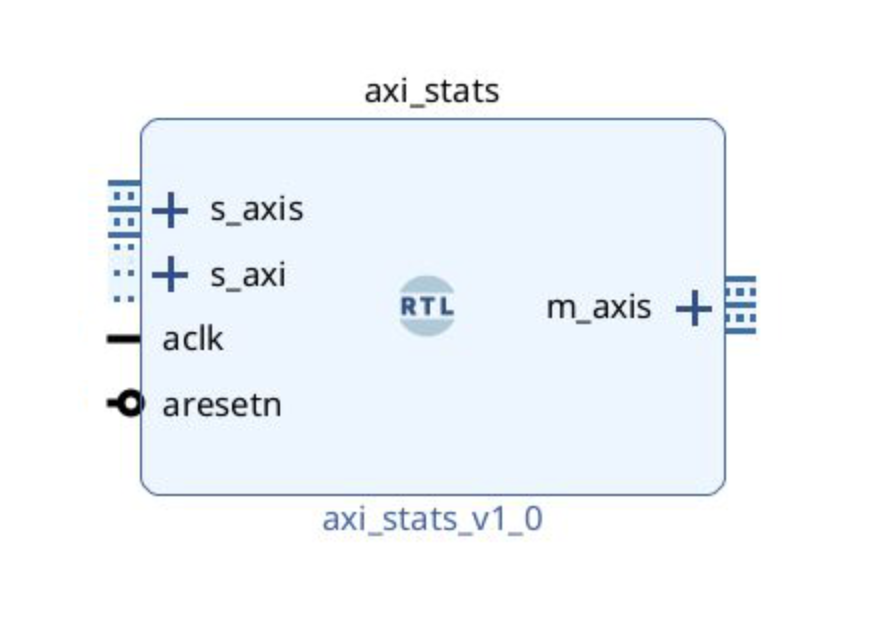

# axistats - A simple AXI-Stream stats module

### Quick introduction

The objective of this project is to provide a *drop-on* stats module for an incoming AXI-Stream. Its implementation is two-fold: compute stats (detailed below) on the incoming stream, propagating it to its output transparently, and exposing an AXI4-Lite interface for gathering the stats.


### Module


The interfaces of the module are the following:

```vhdl
port (
    aclk     : in  std_logic;
    aresetn  : in  std_logic;

    -- AXI Stream interface
    s_axis_tvalid : in  std_logic;
    s_axis_tdata  : in  std_logic_vector(DATA_WIDTH-1 downto 0);
    s_axis_tready : out std_logic;

    m_axis_tvalid : out std_logic;
    m_axis_tdata  : out std_logic_vector(DATA_WIDTH-1 downto 0);
    m_axis_tready : in  std_logic;


    -- AXI4-Lite interface
    -- write address channel
    s_axi_awaddr  : in  std_logic_vector(ADDR_WIDTH-1 downto 0);
    s_axi_awvalid : in  std_logic;
    s_axi_awready : out std_logic;
    -- write data channel
    s_axi_wdata   : in  std_logic_vector(31 downto 0);
    s_axi_wvalid  : in  std_logic;
    s_axi_wready  : out std_logic;
    -- write response channel
    s_axi_bresp   : out std_logic_vector(1 downto 0);
    s_axi_bvalid  : out std_logic;
    s_axi_bready  : in  std_logic;
    -- read address channel
    s_axi_araddr  : in  std_logic_vector(ADDR_WIDTH-1 downto 0);
    s_axi_arvalid : in  std_logic;
    s_axi_arready : out std_logic;
    -- read data channel
    s_axi_rdata   : out std_logic_vector(31 downto 0);
    s_axi_rresp   : out std_logic_vector(1 downto 0);
    s_axi_rvalid  : out std_logic;
    s_axi_rready  : in  std_logic
);
```

Which boils down to an AXI-Stream passthrough and an AXI4-Lite interface:

<p align="center">
    
</p>


The module expects a write to `AXISTATS_CTRL` (offset `0`) with `1` to start the stats collection. It can then be stopped by writing `0` to this same `AXISTATS_CTRL` before reading the stats. The exposed AXI4-Lite offsets are the following:


| Offset |      Name       |                 Description                           |
| ------ | --------------- | ----------------------------------------------------- |
| `0x00` | `AXISTATS_CTRL` |  Control register to enable/disable stats collection  |
| `0x04` | `AXISTATS_TOTC` |  Total cycles                                         |
| `0x08` | `AXISTATS_PKTC` |  Packet count                                         |
| `0x0C` | `AXISTATS_IDLC` |  Idle cycles                                          |
| `0x10` | `AXISTATS_BSTC` |  Burst count                                          |
| `0x14` | `AXISTATS_MAXB` |  Maximum burst length  (successive packets)           |
| `0x18` | `AXISTATS_MING` |  Minimum gap (idle cycles between packets)            |
| `0x1C` | `AXISTATS_MAXG` |  Maximum gap                                          |
| `0x20` | `AXISTATS_GAPC` |  Gap events count                                     |
| `0x24` | `AXISTATS_BSTS` |  Bursts sum                                           |
| `0x28` | `AXISTATS_GAPS` |  Gaps sum                                             |


### Simulation

Simulation sources define two procedures that simulate an AXI4-Lite read and write, reused thoughout the example. It reproduces the logic of:
- passthrough AXI-Stream when not enabled
- enable through a `1` write to the control register
- transparent AXI-Stream transfers, collecting stats
- disable writing `0` to the control register
- reading all stats and reporting:

```
Note: === AXI Stats ===
Note: Total cycles  : 9
Note: Packet count  : 6
Note: Idle cycles   : 3
Note: Burst count   : 3
Note: Max burst     : 2
Note: Min gap       : 1
Note: Max gap       : 1
Note: Gap events    : 2
Note: Sum burst     : 3
Note: Sum gaps      : 2
Note: =================
```


### Usage

1. Add it in your project by running `wget`:

```bash
wget https://raw.githubusercontent.com/QDucasse/axistats/main/axi_stats.vhd
```

2. Connect its different AXI-Stream interfaces. Note that if you want to treat it as a sink, simply add a constant set to `1` to the `m_axis_tready`, accepting all incoming packets directly.

3. Define the address you want the component to be found at in Vivado's address editor.

4. Files in `src/` contain simple definitions to map and access the AXI4-Lite registers through a `petalinux` distribution for example.

